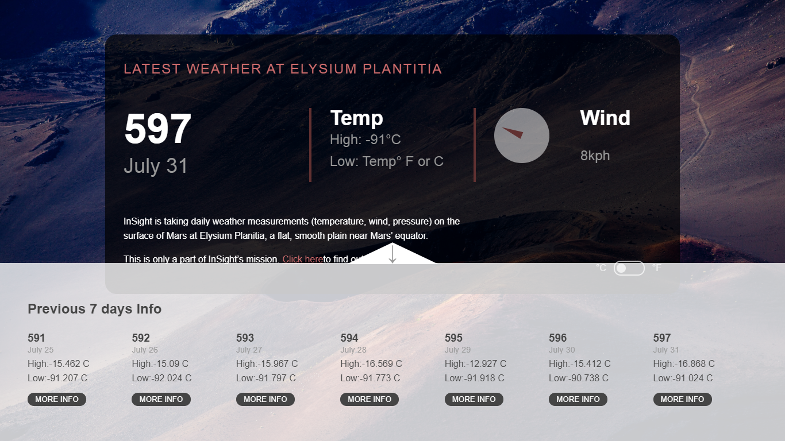

# Weather On Mars - Elysium Plantitia

Have you ever Know whats the weather on mars? Check the weather reports from NASA . 

### Screenshots


_The credit for the concept and most of the styling, goes to Web Dev Simplified.

 ##### Weather Api used 
 ```bash
    https://api.nasa.gov/insight_weather/?api_key=?&feedtype=json&ver=1.0
 ``` 

## Setup

  ##### Clone the repository
```bash
git clone https://github.com/Udit-singh/Weather-On-Mars.git
```
  ##### Move to the desired folder
```bash
cd \Weather-On-Mars
```
  ##### To install the dependencies, simply write
```bash
npm i / npm install
```

  ##### To run the app, simply write
```bash
npm start
```

 ##### To generate a production build, simply run
 ```bash
npm build
 ``` 

## Learn More

You can learn more in the [Create React App documentation](https://facebook.github.io/create-react-app/docs/getting-started).

##### Made with ♥ by <a href="https://github.com/Udit-singh">Udit Singh</a>

[](https://github.com/Udit-singh)